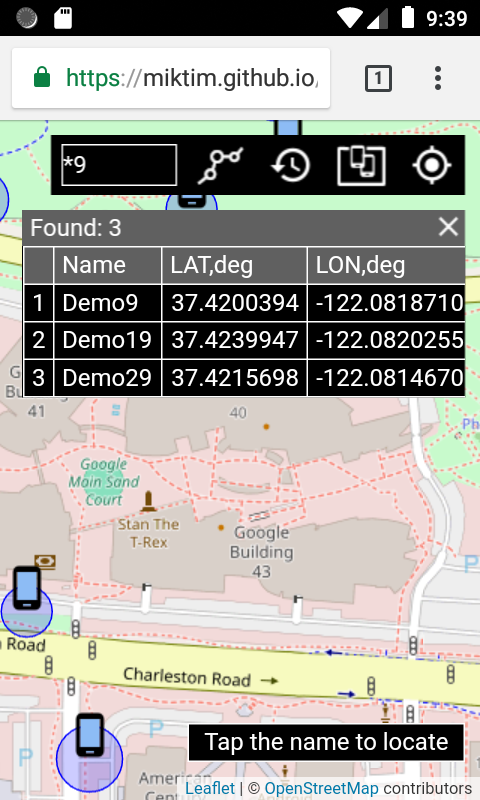
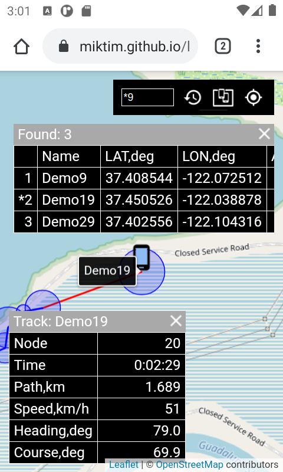

## Leaflet/OSM based GNSS mini tracker, MIT (c) 2019-2024 @miktim

The tracker is designed for mobile browsers to visualize tracked objects or your own location. Interaction with the tracker is carried out through the user interface or by exchanging messages in JSON format via WebView, WebSocket or using the JavaScript API.  

### 1. tracker.html


#### 1.1 tracker.html query parameters (optional):  
 - mode = nowatch  
 Comma delimited modes:  
    debug   - debug JavaScript sources;  
    watch   - watch own location;  
    nowatch - disable watching own location;  
    demo    - run demo.  

  - watch = 5  
  Timeout for monitoring location (seconds)  

  - track = 7:20:1000  
  Minimizing track nodes:  
    deviation(degrees):minDistance(meters):maxDistance(meters)

  - lang = en_US  
  Supported languages: en_US, ru_RU  

  - load = undefined  
    URL of user defined .js. See demo.js as an example. 

  - websocket = undefined  
    WebSocket URI as: ws://host:port/path  
    Note: WebSocket protocol depends on the page protocol: http - ws,  https - wss.
    
    
#### 1.2 tracker.html examples
Run demo (the wonderful ideal world): 
  https://miktim.github.io/mini-tracker/?mode=demo&track=15:30
  

Track your own location:
  https://miktim.github.io/mini-tracker/?mode=watch&watch=5  
  
  ### 2 Mini tracker user interface
  #### 2.1 Objects and controls
  
  

The objects are represented by an icon and a circle with a radius equal to the accuracy of the coordinates. Objects with an expired timeout dim.
  
Controls at the screen top right:
- field to search objects by name. You can use wildcards in the file search style: ? - any single character, * - any characters. Tap the name in the list to locate the object. 
- button to display the message history. The message in the bottom right of the screen is visible for a few seconds. The next message overlaps the previous one.
- button to fit all objects into the screen.  
- button for centering the map according to your own location.  

#### 2.2 Tracking  

- Tap the icon of the object to start tracking. Tap the icon again to stop it. The next track deletes the previous one.
- Tap the node accuracy circle to show node info. Tap the track node info panel (scrolled, contents may vary) to slide it to the left.
- Double-tap on the tracking polyline to copy it to the clipboard in GeoJSON format. Example:  
```
{
  "type":"Feature",
  "properties": {
    "name":"Demo26",
    "nodes": {
      "accuracy": [
        13.4,
        10.6,
        17.1 ],
      "timestamp": [
        1714372050703,
        1714372053719,
        1714372059719 ]
    }
  },
  "geometry": {
    "type":"LineString",
    "coordinates": [
      [-0.001053,51.477551],
      [-0.001081,51.47722],
      [-0.001437,51.476817] ]
  }
}
```  

  
Heading (HDG) is the angle in degrees clockwise from true North to the direction from the previous location to the current one.  
Course (CRS) is the angle in degrees clockwise from true North to direction from the current to the next node.  
Deviation is the angle between heading and course.  
  
### 3. Tracker WebView and WebSocket API  

The tracker communicates with the opposite side (let's call it the "client") via WebView or WebSocket in the similar way:  
- client loads the tracker.html with requred parameters and establishes a connection;  
- client sends a requests (Actions) in UTF-8 JSON format and receives a responses (Events) in UTF-8 JSON format.  

For WebView clients, there are two entry points:  
- Tracker.webview.toTracker(String actionJson);
- Tracker.webview.fromTracker(String eventJson).  

To access tracker events from the Android app, redefine the fromTracker function. For example:  
```
webView.setWebViewClient(new WebViewClient() {
  public void onPageFinished(WebView view, String url) {
    view.loadUrl("javascript: Tracker.webview.fromTracker = 
      function(event) { Android.fromTracker(event); };");
  }
});
```  
See also: https://developer.android.com/develop/ui/views/layout/webapps/webview#UsingJavaScript

The tracker connects to the WebSocket URI using the "tracker.miktim.org" subprotocol.  

Tracker supports two actions:  
- update location source to show object on the map;
- update message to display message.  

Possible response events are "ok" or "error".

An example of a request to display a message on a tracker map in JSON format:  
```
{
  "action": "update:message",
  "message": "Hello, Tracker!"
}
````
Response in JSON:
```
{ "event": "ok:update:message" }
```
Request to show an object with a green icon on the map:
```
{
  "action":"update:locationsource",
  "id":"id Demo1",
  "name":"Demo1",
  "iconid":2,
  "latitude":51.47838445332488,
  "longitude":-0.0018107646286580,
  "accuracy":14.6,
  "timestamp":1711259479572,
  "timeout":3
}
```
Response:
```
{ "event": "ok:update:locationsource" }
```
Example of Error event response:
```
{
  "event": "error:update:locationsource",
  "code": 3,
  "message": "Object property is missing or invalid",
  "type": "trackererror"
}  
```  
When started, the tracker moves the map to the current location (if it is not available, it is the Greenwich Prime Meridian) and sends a Ready event with tracker version.  
```
{
  "event":"ready:tracker:1.1.0",
  "mapCenter":[51.47838445,0.0018107648]
}
```  

#### 3.1 Tracker LocationSource object  

Properties:
| Name | Type | Description |
|-------------|------|------------|
| id | String | required, 'transponder' unique id |
| name | String |required, 'transponder' name |
| latitude | Number | required, WGS-84 latitude in degrees (-90 : 90) |
| longitude | Number | required, WGS-84 longitude in degrees  (-180 : 180) |
| accuracy | Number | required, in meters (radius!) |
| timestamp | Number | required, EpochTimeStamp in MILLISECONDS |
| iconid | Number | optional, (0 : 4) gray, blue, green, red, yellow |
| timeout | Number | optional, location 'lifetime' in SECONDS |
| speed | Number | optional, meters per second |
| heading | Number | optional, the angle in degrees clockwise from true North (0 : 360)|

#### 3.2 Tracker Message object  

Properties:
| Name | Type | Description |
|-------------|------|------------|
| message | String | required. Messages truncated to 64 chars. |  

#### 3.3 Tracker Error Event object  

| Name | Type | Description |
|-------------|------|------------|
| code   | Number | Error code |
| message| String | Error message |
| type   | String | Error type |


#### 3.4 Tracker Ready Event object  

| Name | Type | Description |
|-------------|------|------------|
| mapCenter | [Number, Number] | latitude  and longitude of the map center |

### 4. Tracker JavaScript API  

#### 4.1 Global object Tracker  

**version** constant contains current Tracker version as "1.1.0"

Methods:
| Method | Returns | Description |
|--------|---------|-------------|
| load(\<String> id) |  | load tracker given the DOM ID of a \<div> element |
| whenReady(\<Function> fn) |  | wait for the tracker to load. Event contains readyObj property |
| getMap() | \<Leaflet Map> | |
| LocationSource({properties}) | \<LocationSource> | see above |
| Message(\<String> message) | \<Message> | see above |
| on(\<String> events, \<Function>fn) | this | register events listener |
| once(\<String>events, \<Function> fn) | this | ... listener will only get fired once and then removed |
| off(\<String>events, \<Function> fn) | this | remove listener |  

Tracker Events  

| Event  | Description |
|--------|-------------|
| trackeraction | an event triggered when an WebView/WebSocket action is approved. The details are in the event actionObj property |
| trackererror | an event triggered when an error occurs in a JavaScript action. The details are in the event errorObj property.|  


WebView entries:  
| Method | Returns | Description |
|--------|---------|-------------|
| webview.toTracker(\<String> actionJson) | | pass JSON representation of the Action object to Tracker |
| webview.fromTracker(\<String> eventJson) | | pass JSON representation of the Event object from Tracker |  

#### 4.2 Tracker LocationSource object methods

Methods:

| Method | Returns | Description |
|--------|---------|-------------|
| update() | this | show object on the tracker map|
| getLatLng() | \<LatLng> | get Leaflet-style  geographic point  |
| getPosition() | \<Position> | get Yandex.Maps-style geographic point |
| setLatLng(\<LatLng> p) | this | set Leaflet-style geographic point 
| setPosition(\<Position> p) | this | set Yandex.Maps-style geographic point |

Leaflet-style point \<LatLng> is an object {lat: latitude, lng: longitude}.
Yandex.Maps-style point \<Position> is an array [latitude, longitude]


#### 4.3 Tracker Message object methods   

Methods:

| Method | Returns | Description |
|--------|---------|-------------|
| update() | this | show message on the tracker map|  

#### 4.4 Module Tracker.util  

Functions:

| Function | Returns | Description |
|--------|---------|-------------|
| getUrlSearchParameter(\<String> name)| String | returns URL query parameter value or null |
| trackerMode(\<String>mode) | boolean | returns true if mode present |
| getMobileOperatingSystem() | String | returns mobile OS name (Android, iOS, Windows Phone) or null |  

#### 4.5 Module Tracker.geoUtil  

Functions:

| Function | Returns | Description |
|--------|---------|-------------|
| distance(\<Point>p1, \<Point>p2) | Number| distance from p1 to p2 in meters |
| heading(\<Point>p1, \<Point>p2) | Number | calculate angle in degrees clockwise from true North to direction from p1 to p2 |
| radialPoint(\<Point>p, \<Number>heading, \<Number>distance) | \<Point>  | calculate geographic point from p with given heading (degrees) and distance (meteres)|

\<Point> can be \<LatLng> or \<Position>. Returned value has same type.  

