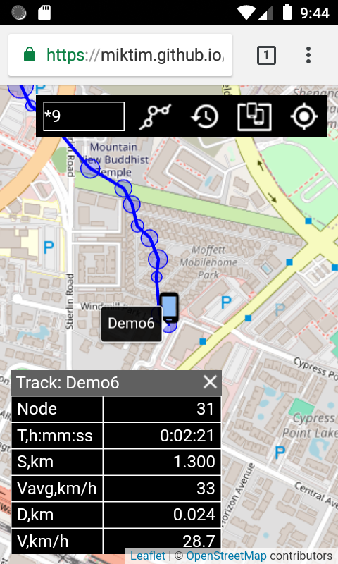

## Leaflet GNSS mini tracker, MIT (c) 2019-2024 @miktim

The tracker is designed to visualize tracked objects or your own location. Interaction with the tracker is carried out through the user interface or by exchanging messages in JSON format via WebView, WebSocket or using the JavaScript API.  

### 1. tracker.html


#### 1.1 Tracker html URL query parameters (optional):  
 - mode = nowatch (comma delimited modes):  
    debug   - debug source;  
    watch   - watch own location;  
    nowatch - disable watching own location;  
    demo    - run demo.  

  - watch = 5 Timeout for monitoring own location (seconds)

  - track = 7:20:1000 Minimizing track nodes:  
    deviation(degrees):minDistance(meters):maxDistance(meters)

  - lang = browser defaults or en_US Supported: en_US, ru_RU

  - websocket = undefined WebSocketURI  
    Note: WebSocket protocol depends on the page protocol: http - ws,  https - wss.
    
    
#### 1.2 tracker.html examples
Run demo (the wonderful ideal world): 
  https://miktim.github.io/mini-tracker/?mode=demo&track=15:30
  

Track your own location:
  https://miktim.github.io/mini-tracker/?mode=watch&watch=5  
  
  ### 2 Mini tracker user interface
  #### 2.1 Objects and controls
  
  

The objects are represented by an icon and a circle with a radius equal to the accuracy of the coordinates. 
  
Controls:
- Search field. You can use wildcards in the file search style: ? - any single character, * - any characters. Swipe left-right and up-down through the search list. Tap the name to locate the object.
- Show all objects button
- Center map to your own location button  

#### 2.2 Tracking  

Tap the icon of the object to start tracking. Tap the icon again to stop it. Tap the track node info panel (its content may vary) to shift it to the left. Tap the node accuracy circle to show node info.  
<br>
  
Heading is the angle in degrees clockwise from true North to direction from the previous to the current location.  
Course is the angle in degrees clockwise from true North to direction from the current to the next node.  
Deviation is the angle between heading and course.  
  
### 3. Tracker WebView and WebSocket API  

The tracker communicates with the opposite side (let's call it the "client") via WebView or WebSocket in the same way:  
- client loads the tracker.html with requred parameters and establishes a connection;  
- client sends a requests (Actions) in UTF-8 JSON format and receives a responses in UTF-8 JSON format (Events).  

For WebView clients, the tracker has two entry points:  
- Tracker.webview.toTracker(String actionJson);
- Tracker.webview.fromTracker(String eventJson).  

The tracker connects to the WebSocket URI using subprotocol tracker.miktim.org

Tracker supports two actions:  
- update location source to show object on the map;
- update message to display message.  

Possible response events are "ok" or "error".

Example of a request to show a message on the tracker map in JSON format:  
```
{
  "action": "update:message",
  "message": "Hello, Tracker!"
}
````
Response in JSON:
```
{ "event": "ok:update:message" }
```
Request to show an object with a green icon on the map:
```
{
  "action":"update:locationsource",
  "id":"id Demo1",
  "name":"Demo1",
  "iconid":2,
  "latitude":51.47838445332488,
  "longitude":-0.0018107646286580348,
  "accuracy":14.6,
  "timestamp":1711259479572,
  "timeout":3
}
```
Response:
```
{ "event": "ok:update:locationsource" }
```
Example of Error Event response:
```
{
  "event": "error:update:locationsource",
  "code": 3,
  "message": "Object property is missing or invalid",
  "type": "trackererror"
}  
```  
When started, the tracker moves the map to the current location (if unaccesible it is the Prime Meridian Greenwich) and sends a Ready Event.  
```
{
  "event":"ready:minitracker",
  "version":"1.1.0",
  "latitude":51.47838445,
  "longitude":-0.0018107648,
  "trueLocation":false
}
```  

#### 3.1 Tracker LocationSource object  

Properties:
| Name | Type | Description |
|-------------|------|------------|
| id | String | required, 'transponder' unique id |
| name | String |required, 'transponder' name |
| iconid | Number | optional, (0 : 4) gray, blue, green, red, yellow |
| timeout | Number | optional, location 'lifetime' in SECONDS |
| latitude | Number | required, latitude WGS-84 in degrees (-90 : 90)|
|longitude | Number | required, longitude WGS-84 in degrees (-180 : 180)|
| accuracy | Number | required, in meters (radius!) |
| timestamp | Number | required, EpochTimeStamp in MILLISECONDS |
| speed | Number | optional, meters per second |
| heading | Number |optional, the angle in degrees clockwise from true North from the previous to the current location (0 : 360)|

#### 3.2 Tracker Message object  

Properties:
| Name | Type | Description |
|-------------|------|------------|
| message | String | required. Messages truncated to 64 chars. |  

#### 3.3 Tracker Event Error object  

| Name | Type | Description |
|-------------|------|------------|
| code   | Number | Error code |
| message| String | Error message |
| type   | String | Error type |


#### 3.4 Tracker Event Ready object  

| Name | Type | Description |
|-------------|------|------------|
| version   | String | Tracker version |
| latitude | Number | latitude of map center |
| longitude   | Number | longitude of map center |
| trueLocation | boolean | is the location correct |  

### 4. Tracker JavaScript API  

#### 4.1 Global object Tracker  

**version** constant contains current Tracker version as "1.1.0"

Methods:
| Method | Returns | Description |
|--------|---------|-------------|
| load(mapid) |  | load tracker given the DOM ID of a \<div> element |
| getMap() | \<Leaflet Map> object | |
| LocationSource({properties}) | \<LocationSource> | see above |
| Message(\<String> message) | \<Message> | see above |
| on(events\<String>, listener) | this | register events listener |
| once(events\<String>, listener)) | this | ... listener will only get fired once and then removed |
| off(events\<String>) | this | remove listener |  

Tracker Events  

| Event  | Description |
|--------|-------------|
| ready |  when tracker ready. The details are in readyObj property |
| trackeraction | an event triggered when an WebView/WebSocket action is approved. The details are in actionObj property |
| trackererror | an event triggered when an error occurs in a JavaScript action. The details are in the errorObj property.|  


WebView entries:  
| Method | Returns | Description |
|--------|---------|-------------|
| webview.toTracker(\<String> actionJson) | | pass JSON representation of the Action object to Tracker |
| webview.fromTracker(\<String> eventJson) | | pass JSON representation of the Event object from Tracker |  

#### 4.2 Tracker LocationSource object methods

Methods:

| Method | Returns | Description |
|--------|---------|-------------|
| update() | this | show object on the tracker map|
| getLatLng() | \<LatLng> | get Leaflet-style  geographic point  |
| getPosition() | \<Position> | get Yandex.Maps-style geographic point |
| setLatLng(\<LatLng>) | this | set Leaflet-style geographic point 
| setPosition(\<Position>) | this | set Yandex.Maps-style geographic point |

Leaflet-style point \<LatLng> is an object {lat: latitude, lng: longitude}.
Yandex.Maps-style point \<Position> is an array [latitude, longitude]


#### 4.3 Tracker Message object methods   

Methods:

| Method | Returns | Description |
|--------|---------|-------------|
| update() | this | show message on the tracker map|  

#### 4.4 Module Tracker.util  

Functions:

| Function | Returns | Description |
|--------|---------|-------------|
| getUrlSearchParameter(name \<String>)| String | returns URL query parameter value or null |
| trackerMode(mode \<String>) | boolean | returns true if mode present |  

#### 4.5 Module Tracker.geoUtil  

Functions:

| Function | Returns | Description |
|--------|---------|-------------|
| distance(p1\<Point>, p2\<Point>) | Number| distance from p1 to p2 in meters |
| heading(p1\<Point>, p2\<Point>) | Number | calculate angle in degrees clockwise from true North to direction from p1 to p2 |
| radialPoint(p\<Point>,heading\<Number>, distance\<Number>) | \<Point>  | calculate geographic point from p with given heading and distance |

\<Point> can be \<LatLng> or \<Position>. Returned value has same type.  

